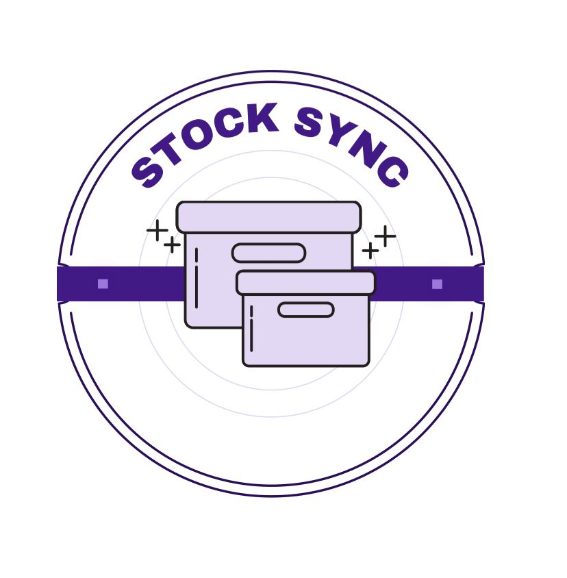

<<<<<<< HEAD
# 📦 Stock Sync: Inventory & Product Management System



> Nosso sistema é uma aplicação web, focada exclusivamente no gerenciamento de estoque, projetada para ser radicalmente simples, intuitiva e acessível para micro e pequenos empreendedores.

---

 ## 🧑‍💻 Tecnologias Utilizadas


---

## 👁️ Visão Geral do Projeto

### 1.1. ⚠️ O Problema de Mercado

Micro e pequenos empreendedores enfrentam desafios significativos na gestão de seus inventários. A ausência de ferramentas adequadas resulta em:

- ❌ **Controle Manual Ineficiente:** Uso de planilhas, cadernos ou métodos informais, que são propensos a **erros humanos**.
- 📉 **Discrepância de Estoque:** Venda de produtos indisponíveis ou falha em repor itens de alta demanda, gerando **perda de receita e de credibilidade**.
- 🤔 **Decisões Não Embasadas:** Dificuldade em obter uma visão clara e em tempo real da quantidade e do valor dos produtos em estoque.
- 💰 **Alto Custo de Alternativas:** Soluções de mercado (sistemas ERP) são frequentemente superdimensionadas, complexas e com alto custo de licenciamento, representando uma **barreira** para este público.

### 1.2. 💡 Proposta de Valor

Nossa solução é uma aplicação web, que traz uma forma simplificada de gestão de estoque, além de uma interface gráfica minimalista e agradável ao usuário, nela o usuário pode criar novos estoques, editar ou deletar estoques existentes, ver os detalhes de cada um, trazendo uma indivualidade de cada estoque, onde cada um tem sua lista de produtos próprios, além de poder cadastrar e manipular os produtos cadastrados de forma lógica.
=======
This is a [Next.js](https://nextjs.org) project bootstrapped with [`create-next-app`](https://nextjs.org/docs/app/api-reference/cli/create-next-app).

## Getting Started

First, run the development server:

```bash
npm run dev
# or
yarn dev
# or
pnpm dev
# or
bun dev
```

Open [http://localhost:3000](http://localhost:3000) with your browser to see the result.

You can start editing the page by modifying `app/page.tsx`. The page auto-updates as you edit the file.

This project uses [`next/font`](https://nextjs.org/docs/app/building-your-application/optimizing/fonts) to automatically optimize and load [Geist](https://vercel.com/font), a new font family for Vercel.

## Learn More

To learn more about Next.js, take a look at the following resources:

- [Next.js Documentation](https://nextjs.org/docs) - learn about Next.js features and API.
- [Learn Next.js](https://nextjs.org/learn) - an interactive Next.js tutorial.

You can check out [the Next.js GitHub repository](https://github.com/vercel/next.js) - your feedback and contributions are welcome!

## Deploy on Vercel

The easiest way to deploy your Next.js app is to use the [Vercel Platform](https://vercel.com/new?utm_medium=default-template&filter=next.js&utm_source=create-next-app&utm_campaign=create-next-app-readme) from the creators of Next.js.

Check out our [Next.js deployment documentation](https://nextjs.org/docs/app/building-your-application/deploying) for more details.
>>>>>>> master
